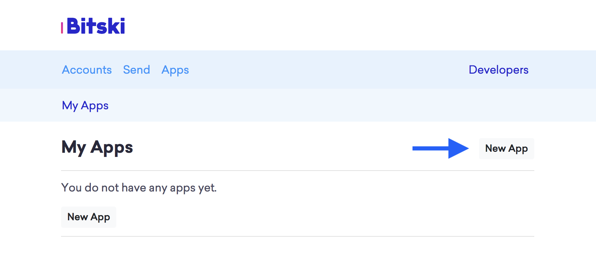
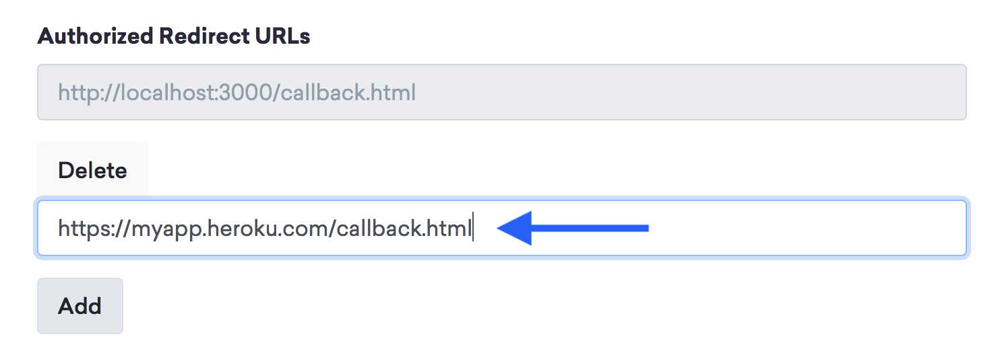

# Bitski Dapp Quickstart

This is a quick starting point for a web dapp built using Truffle and the Bitski SDK. The front-end is powered by plain javascript using webpack, and can easily be swapped out. This project is also configured to be easily deployed to Heroku.

## Project structure

Path | Description
----- | -------
app/ | example javascript front-end app that demonstrates Bitski sign in, web3 usage, and importing contracts.
build/ | the compiled json metadata for your contracts (generated from `truffle migrate`).
contracts/ | Solidity contracts for your dapp.
migrations/ | Truffle migrations for your dapp. See `2_deploy_contracts.js` for an example of deploying a contract.
public/ | static files to be served from your app's root.
test/ | truffle tests
package.json | metadata about this project. customize with your details.
bitski.config.js | bitski configuration. update with your app's client id, and app wallet info.

## Prerequisites

- NPM
- Node
- [Truffle Framework](https://truffleframework.com) `npm install -g truffle`
- [Heroku CLI](https://devcenter.heroku.com/articles/heroku-cli) if you want to deploy to Heroku

## Setup

First clone the repo, or unpack the truffle box (coming soon).

Install the dependencies:

```
npm install
```

## Creating your Client ID & App Wallet

You'll need a Bitski client id to run this app. Your client id provides some basic information to users about your application, and links various permissions granted by the user to your app.

Visit Bitski's [Developer Portal](https://developer.bitski.com), create an account if you haven't already, and create a client id.

https://developer.bitski.com



Then you'll also want to add a redirect URL for localhost, where we'll be running the app locally: `http://localhost:3000/callback.html`


Note: Your client id may need to be approved before you can use it, since Bitski is currently in beta.

## Developing locally

This example uses webpack to combine some simple static files and plain javascript. Locally we'll use webpack-dev-server to run the app.

First, start Truffle's development blockchain:

```
truffle develop
```

If it's your first run, you'll also need to run the migrations:

```
truffle> migrate
```

Then, in a new terminal window, run the development web server:

```
npm run dev
```

Visit http://localhost:3000 to run the app. If everything is set up correctly, you should be able to log in to the dapp and see your wallet address. While in development mode, changes you make to the app will automatically trigger a reload of the page.

## Customizing the Dapp

Getting the example code working is just the beginning. Now it's up to your imagination to bring this dapp to life.

Start by designing your contract using Solidity. You'll put any contracts you write or reference in the /contracts folder. We've created a placeholder contract `MyContract.sol` that you can modify, or simply create a new .sol file.

- Solidity Documentation
- Dapp tutorial

Then, you'll want to write some simple tests to make sure your contract logic works as expected. Those go under the /tests folder. You can test them by running `truffle test`.

- Truffle Docs: Testing

Once your contract is looking good, you'll want to get it built and deployed. You'll need to write migrations to deploy each of your contracts to the blockchain. See `migrations/2_deploy_contracts.js` for a very simple example. These migration files are run when you call `truffle migrate`.

- Truffle Docs: Migrations

Now that your contract is deployed, you should have a json file representing the contract you wrote in /build/contracts. You can use that file to call methods on your contract. See `app/app.js` and `app/contract.js` for example usage.

- Web3's Contract documentation

## Deploying to a public server using Heroku

This template is designed to be easy to deploy on Heroku for live demos. The server is powered by `server.js`, a simple Express app that routes the files created by webpack.

#### Step 1: Deploy your contract with Truffle & Bitski App Wallet

First, since this will be a publicly accessible app you'll want to deploy your contract on public blockchain as well. Decide if you're going to use a test network (kovan or rinkeby) where ETH can be acquired for free, or live network where you'll have to pay with real ETH.

In order to deploy using Bitski, you'll need to have set up an app wallet, and included your app wallet id and secret in bitski.config.js. If you haven't already set one up, visit the [Developer Portal](https://developer.bitski.com) and set one up now.

Then, run the migrate command with the desired network value (live, kovan, or rinkeby):

```
truffle migrate --network live
```

#### Step 2: Deploy your front-end app on Heroku

Create your heroku app using heroku-cli:

```
heroku create
```

Important! Now that you have a dedicated URL for your app, update your redirect url in the [developer portal](https://developer.bitski.com) to include your callback route on the new domain (https://my-app.herokuapp.com/callback.html).



Then, make sure your `bitski.config.js` production environment is configured correctly:

- Add your new domain to environments.production.redirectURL
- Make sure environments.production.network matches where your contract was deployed

Commit your changes:

```
git add .
git commit -m "Made some changes"
```

Then, push to Heroku:

```
git push heroku master
```

Finally, check out your live site!

```
heroku open
```

Whenever you want to update the front-end application, simply commit your changes and push to heroku again.
